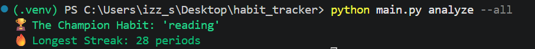
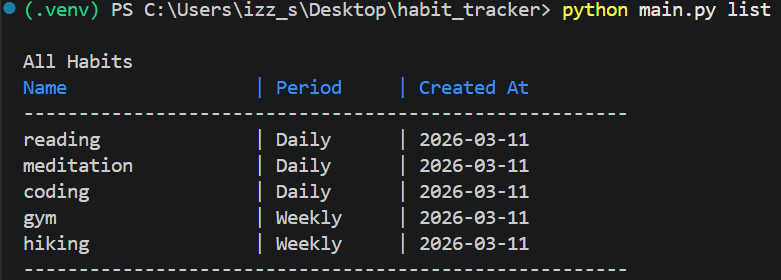
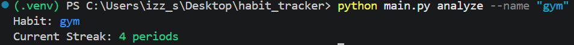
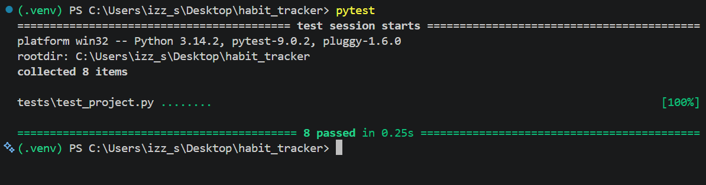

# OOFPP Habit Tracker

OOFPP Habit Tracker is a robust **Command Line Interface (CLI)** application for tracking and analyzing personal habits.  
The project demonstrates the use of **Object-Oriented Programming (OOP)** for habit management and **Functional Programming** for analytical operations.

---

## Features

- **Habit Management:** Create, delete, and manage habits with `Daily` or `Weekly` frequency.
- **Habit Tracking:** Check off habits for the current period with a single command.
- **Analytics:** Analyze habit data to calculate streaks, including:
  - Longest streak for a specific habit
  - Best-performing "Champion" habit overall
- **Data Persistence:** Uses **SQLite3** to store data reliably between sessions.
- **Interactive CLI:** Color-coded output, formatted tables, and safety prompts (e.g., overwrite confirmation).
- **Automated Data Seeding:** Automatically populates the database with 5 predefined habits and **4 weeks of time-series test data** upon first launch for immediate testing.
---
## Screenshots

*Example of the CLI interface and analytics output.*


*Example of the CLI interface and list output.*


*Example of the CLI interface and analyze habit gym  output.*


*100% passing test suite using pytest.*
---

## Installation & Setup

### Prerequisites

- Python **3.10 or higher**
- Git

### 1. Clone the Repository

Download the code to your local machine:

```bash
git clone [https://github.com/YOUR_USERNAME/oofpp-habit-tracker.git](https://github.com/YOUR_USERNAME/oofpp-habit-tracker.git)
cd oofpp-habit-tracker
```

### 2. Set Up a Virtual Environment

It is highly recommended to run this project inside a virtual environment to keep dependencies isolated.

#### Create the virtual environment

```bash
python -m venv .venv
```

### Activate the virtual environment (Windows)

```bash
.\.venv\Scripts\activate
```

### Activate the virtual environment (Mac/Linux)

```bash
source .venv/bin/activate
```

### 3. Install Dependencies

```bash
pip install -r requirements.txt
```

---

### How the Automatic Seeding Works

- To provide a "zero-friction startup" for evaluators and new users, this application features an automated database initialization sequence.
- The very first time you execute any CLI command (e.g., **_python main.py --help_**), the main.py controller automatically checks the SQLite database.
- Schema Creation: If the tables do not exist, it executes CREATE TABLE IF NOT EXISTS.
- Data Injection: If the habit table is completely empty, it safely triggers the seed_data() module.
- The Test Data: It injects 5 predefined habits (3 Daily, 2 Weekly) and backdates 4 weeks (28 days) of simulated check-off data.
- Safety Check: On all subsequent runs, the app detects that data exists and instantly skips the seeding process, guaranteeing that user data is never overwritten.
- This allows you to test the Analytics engine immediately without having to spend weeks manually logging habits!

---

## Usage Guide

- **Create a New Habit**
  _Add a new habit to the tracker._

```bash
python main.py create --name "Reading" --period "Daily"
```

### Options:

- `--name`
  Unique name of the habit (e.g., "Gym", "Code").
- `--period`
  _Habit frequency must be either daily or weekly (case-insensitive.
  If a habit already exists, you will be prompted before overwriting it._

- **Check Off a Habit**
  Mark a habit as completed for the current period.

```bash
python main.py check --name "Reading"
```

- **List All Habits**
  Display a formatted table of all tracked habits.

```bash
  python main.py list
```

Filter habits by period:

```bash
python main.py list --period "Weekly"
```

- **Analyze Progress**
  Analyze habit streaks using functional programming logic.
  Analyze a specific habit:

```bash
python main.py analyze --name "Reading"
```

Find the champion habit (longest streak overall):

```bash
python main.py analyze --all
```

- **Delete a Habit**
  Permanently remove a habit and its entire history.

```bash
python main.py delete --name "Reading"
```

### Testing

_This project includes a comprehensive test suite using `pytest`.
Tests run in a temporary database environment to ensure real data is never affected._

Run tests with:

```bash
pytest
```

---

## Project Structure

`main.py`
Entry point for the CLI and command handling.

`habit.py`
Defines the Habit class using Object-Oriented principles.

`analytics.py`
Functional programming module for streak calculations.

`db.py`
SQLite database connection and schema management.

`test_project.py`
Unit tests for validation and correctness.
